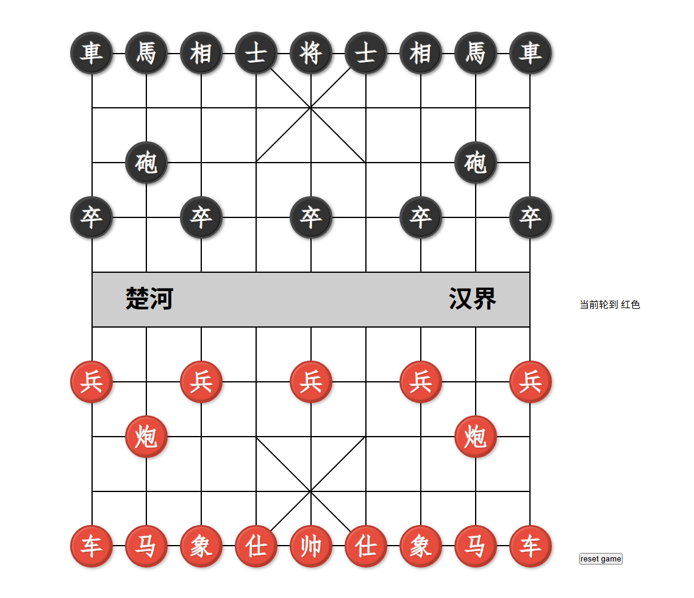

# ChineseChess

## 项目说明
本项目未使用前端框架，仅使用JavaScript和CSS进行开发，适合前端新手上手。

## 开发
本项目开发需要安装一个服务器、推荐使用 [serve](https://www.npmjs.com/package/serve)

```bash
npm install -g serve
serve
```
通过 serve 命令启动开发时，需要删除 `index.mjs` 里面的 `import "./src/css/main.css"` 语句即可。


## 打包
如果项目需要打包使用，则推荐使用 [rollup](https://www.npmjs.com/package/rollup) , 并且需要在 `index.mjs` 加上 css 文件的引入
```bash
npm install -g rollup
npm install postcss @rollup/plugin-html rollup-plugin-postcss --save-dev
```

---

## 已经实现的功能
- 点击棋子后进行走子
- 右侧提示当前行动的棋手
- 将杀的简单判断

## 尚未实现的功能
- 更好的将杀判断
- 点击棋子后，提示可以移动的位置信息
- 每走一步之后棋谱的录入


## 项目截图

